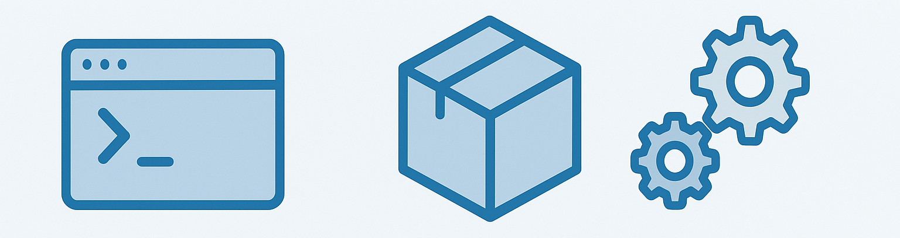

# Introduction

**PackagingLab** is a personal project focused on experimenting with different software packaging and distribution formats.

The goal is to explore the strengths, limitations, and workflows of tools such as AppImage, Flatpak, conda-forge and others—by packaging real software projects and documenting the process.

This site serves as a simple record of what I learn along the way, including:

- How to build and structure packages for each format
- Common pitfalls and how to solve them
- Comparisons between systems

The project is not meant to provide tutorials, but rather to document experience, experimentation, and lessons learned.
